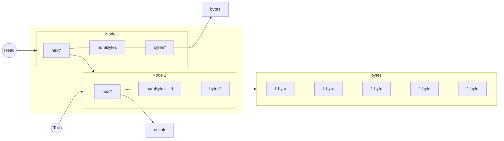

### Project #3 README.md

**1. Which program is fastest? Is it always the fastest?**

	Out of 15 runs of make, two thirds of the time alloca.out had the quickest execution Time. malloc.out was quicker the remaining 5 .

**2. Which program is slowest? Is it always the slowest?**

	new.out tends to be the slowest but it was not always the slowest. A third of the time the Avg Time was faster than list.out.

**3. Was there a trend in program execution time based on the size of data in each Node? If so, what, and why?**

	MAX_BYTES has a larger impact on the execution time than MIN_BYTES, extending the time the programs run as MAX_BYTES grows larger. 

**4. Was there a trend in program execution time based on the length of the block chain?**

	Increasing the length of the block chain by a multiplication factor of x also increases the run time by x.

**5. Consider heap breaks, what's noticeable? Does increasing the stack size affect the heap? Speculate on any similarities and differences in programs?**

	Yes it does but only for alloca.out, which stopped at 66 each time I forgot to increase the limit of the stack to unlimited. 

**6. Considering either the malloc.cpp or alloca.cpp versions of the program, generate a diagram showing two Nodes. Include in the diagram
	- the relationship of the head, tail, and Node next pointers.
	- show the size (in bytes) and structure of a Node that allocated six bytes of data
	- include the bytes pointer, and indicate using an arrow which byte in the allocated memory it points to.**
	

**7. There's an overhead to allocating memory, initializing it, and eventually processing (in our case, hashing it). For each program, were any of these tasks the same? Which one(s) were different?**

	Allocating memory is different in each program, with alloca.cpp using alloca() then new, malloc.cpp using malloc() then new, list.cpp using only .push_back(), and new.cpp using only new. list.cpp and alloca.cpp do not need to explicitly release the memory they allocated but new.cpp and malloc.cpp do. Only list.cpp initializes the memory by using push_back(), the rest of the programs use new. Finally hashing is done in main() using a for-loop in new.cpp, list.cpp, and malloc.cpp. list.cpp does use a for-loop to hash but it's located in a recursive method called process(). The hash method works the same in all four programs. 

**8. As the size of data in a Node increases, does the significance of allocating the node increase or decrease?**

	Yes because as the groups of Bytes grows larger so does the space in memory that needs to be allocated and if the size of Bytes is larger than the cache line, that can further increase the significance. 
