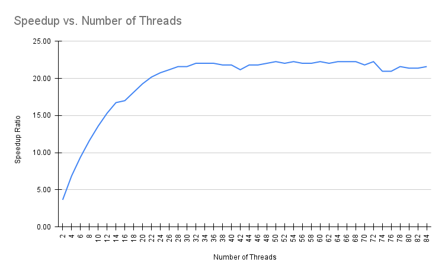
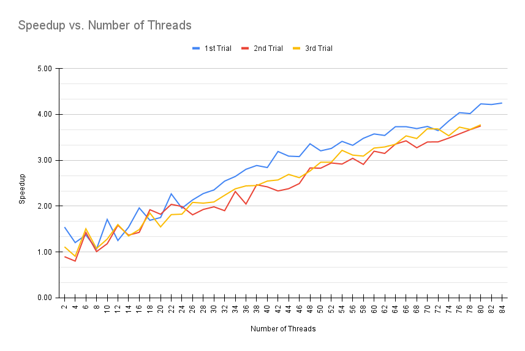

### Project #4 README.md

**"Computing a Mean" Questions**

* Ratio converges to around 22.30. The maximum speedup value I got is 22.26. When I use more cores than avvailable, I lose speed a little over a quarter of the avaiable cores.

* The scaling does start off linear but once it reaches a certain number of threads, then it gradually tapers off.

* I found P using the formulas that were given.

$$S = \frac{single-thread\ run\ time}{multi-thread\ run\ time}$$
$$T = (1-p)T + pT$$
$$T_n = (1-p)T + \frac{p}{n}T$$

I subsituted single thread tun time with T, multi-thread run time with $T_n$, and solved for p. Ending up with the formula: 

$$p = \frac{1-\frac{1}{S}}{1-\frac{1}{n}}$$

* Bytes of data required per iteration? 4 bytes
* Associated bandwidth used by the kernel?
$$\frac{8500000000 * 4\ bytes}{21.59\ sec} = 1.58 x 10^9 bytes/sec = 1.58 GB/sec$$

* No as the threaded version is even faster. 2-threads being 5.74 GB/sec and 4-threads being 10.79 GB/sec.

**"Computing a Volume" Questions**

* The curve is more linear.
  
* I can 3 separate trials, making sure that Blue wasn't too busy, and noted so on the chart above.
