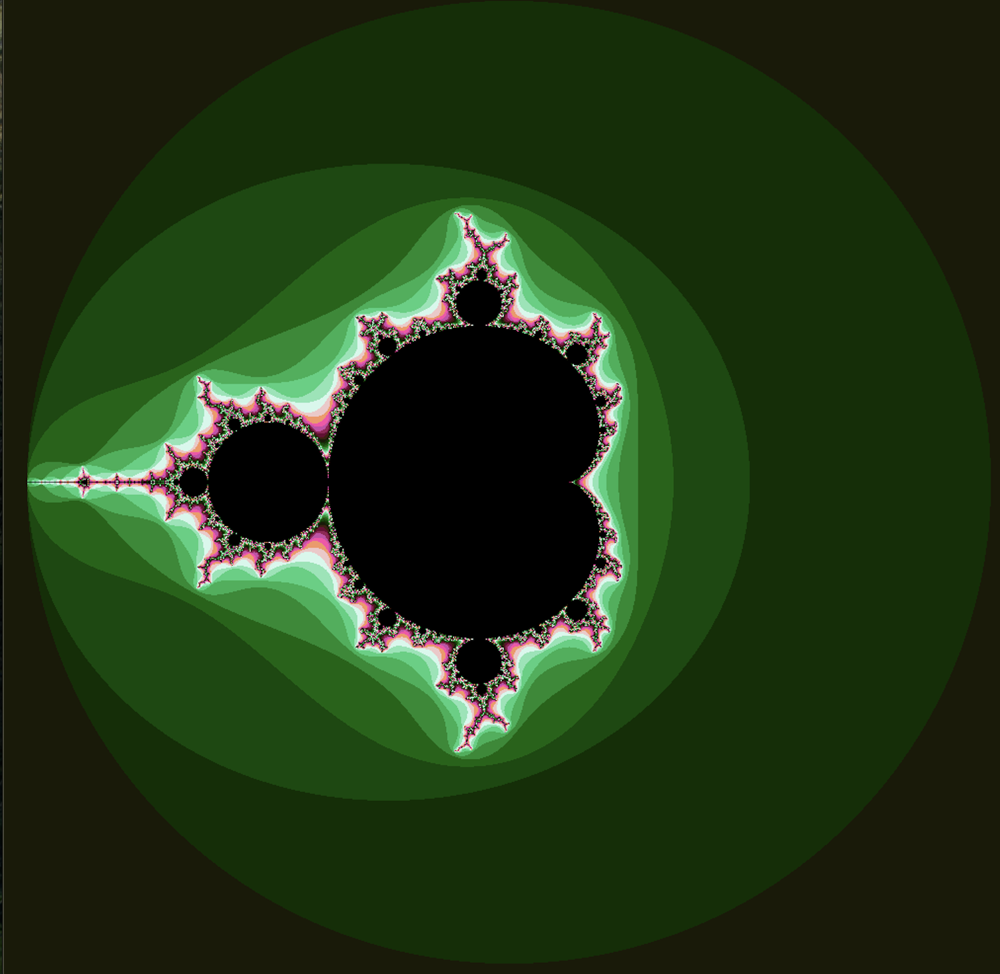
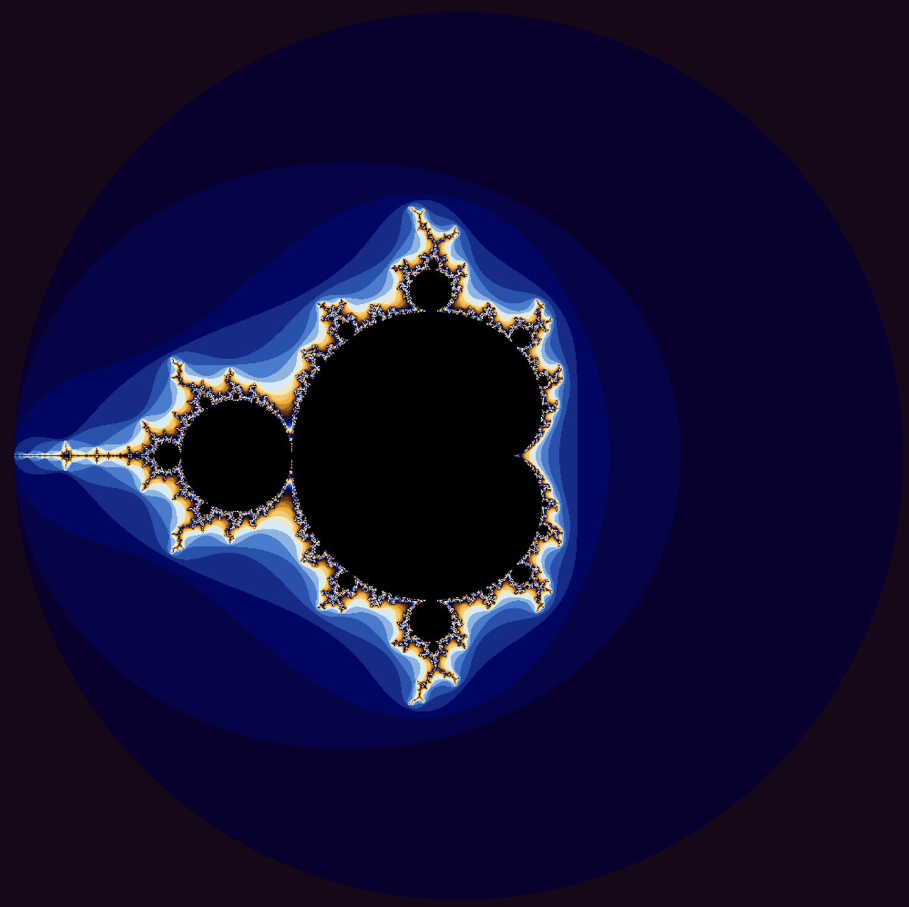

### README for Project 6 ###

* iota.cpu: Fills in a large vector with elements of incrementing value, starting with the given starting value;

* iota.gpu: Does the same as iota.cpu but utilizes the gpu in an effort to improve the program's speed.

* julia.cpu: Creates an image of a julia set.

* julia.gpu: Utilizes the gpu to create an image of a julia set in a far quicker time.

The timing results of iota are not quite what I expected. I had thought the timing with be closer between the cpu and gpu versions. I think the reason why the times for the gpu take longer is becasue of cudaMemcpy undoes any time gained by using the gpu.

Green Julia Set

Orignal Julia Set

